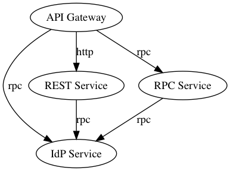

# Examples

The packages in this directory are example illustrating how to use
Shisa.

## Architecture



## Services

- [`gw`](gw) - A Shisa implemenation talking to the `rest` and `rpc` services.
- [`rest`](rest) - A "legacy" RESTful web service implementing the "goodbye" service
- [`rpc`](rpc) - A "modern" RPC service implementing the "hello" service
- [`idp`](idp) - An Identity Provider service used by the other services.

## Building

To build all the service program files run the following from the
project root:

    make examples

## Running

Each service must run on a unique port or on a separate (virtual)
machine.  To run on a single host, run the following commands from the
project root.  Adjust the port numbers (or addreses) as needed to suit
your environment.

1. Start `idp`

    ``` shell
    bin/idp -addr ":9601"
    ```

1. Start `rest`

    ``` shell
    export IDP_SERVICE_ADDR=":9601"
    bin/rest -addr ":9501"
    ```

1. Start `rpc`:

    ``` shell
    export IDP_SERVICE_ADDR=":9601"
    bin/rpc -addr ":9401"
    ```

1. Start `gw`:

    ``` shell
    export IDP_SERVICE_ADDR=":9601"
    export GOODBYE_SERVICE_ADDR=":9501"
    export HELLO_SERVICE_ADDR=":9401"
    bin/gw -addr ":9001"
    ```

You can now access these URLs for the services:

### IdP

- Debug Vars - <http://localhost:9601/debug/vars>
- Debug RPC - <http://localhost:9601/debug/rpc>

### Goodbye

- Healthcheck - <http://localhost:9501/healthcheck>
- Debug Vars - <http://localhost:9501/debug/vars>

### Hello

- Debug Vars - <http://localhost:9401/debug/vars>
- Debug RPC - <http://localhost:9401/debug/rpc>

### API Gateway

The `healthcheck` and `debug` endpoints require authentication by the 
"admin" user: `Admin:password`.  The `api/greeting` and `api/farewell`
endpoints can be accessed by the "admin" user or `Boss:password`.

- Healthcheck - <http://localhost:9001/healthcheck>
- Debug Vars - <http://localhost:9001/debug/vars>
- Greeting Endpoint - <http://localhost:9001/api/greeting>
- Farewall Endpoint - <http://localhost:9001/api/farewell>
